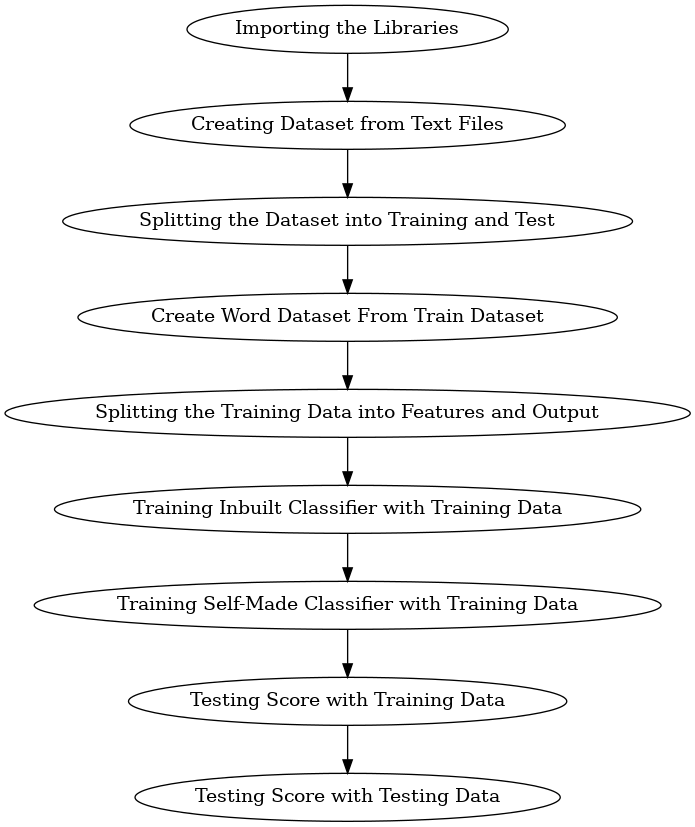

# News Genre Classification Project

- ## Overview
  This project involves building a text classification pipeline to categorize news articles into 20 predefined genres. Each genre contains 1,000 files, resulting in a total dataset of 20,000 text files. It uses Python to preprocess data, extract features, and train a Naive Bayes classifier. The project is divided into several components, each encapsulated in modular scripts for clarity and reusability.

  ### Genres:
  The following table lists the 20 genres included in the dataset:

  | **Genre**                            | **Description**                 |
  |--------------------------------------|---------------------------------|
  | `alt.atheism`                        | Atheism discussions             |
  | `comp.graphics`                      | Computer graphics               |
  | `comp.os.ms-windows.misc`            | Miscellaneous Windows topics    |
  | `comp.sys.ibm.pc.hardware`           | IBM PC hardware topics          |
  | `comp.sys.mac.hardware`              | Macintosh hardware topics       |
  | `comp.windows.x`                     | X Window System topics          |
  | `misc.forsale`                       | Miscellaneous sales listings    |
  | `rec.autos`                          | Automotive topics               |
  | `rec.motorcycles`                    | Motorcycle-related discussions  |
  | `rec.sport.baseball`                 | Baseball discussions            |
  | `rec.sport.hockey`                   | Hockey discussions              |
  | `sci.crypt`                          | Cryptography topics             |
  | `sci.electronics`                    | Electronics-related discussions |
  | `sci.med`                            | Medical-related discussions     |
  | `sci.space`                          | Space-related discussions       |
  | `soc.religion.christian`             | Christian religious discussions |
  | `talk.politics.guns`                 | Gun control politics            |
  | `talk.politics.mideast`              | Middle East political topics    |
  | `talk.politics.misc`                 | Miscellaneous political topics  |
  | `talk.religion.misc`                 | Miscellaneous religious topics |

  You can download the dataset using [**this link**](https://archive.ics.uci.edu/dataset/113/twenty+newsgroups).

- ## Project Components

  - ### Data Preparation
    - **File:** `create_dataset.py`
    - **Classes:**
      - `TextDataset`: Extracts and organizes data from text files into a structured dataset.
        - **Methods:**
          - ` __init__(folderPath: str)`: Initializes the dataset with a folder path containing subfolders (categories).
          - `create_Text_Dataset()`: Reads text files, assigns categories, and saves the dataset as `News_Data.csv`.
        - **Workflow:**
          - **Input:** A directory with subfolders representing categories.
          - **Output:** A CSV file (News_Data.csv) and a feature-engineered dataset.

      - `WordDataset`: Prepares data for model training by extracting word-level features.
        - **Methods:**
          - `fit(x: pd.DataFrame, y: pd.DataFrame)`: Identifies high-frequency words as features and creates a dataset based on these features.
          - `create_Dataset(x: pd.DataFrame, y: pd.DataFrame)`: Transforms input text into a numerical format based on feature word frequencies

  - ### Classification Model      
    - **File:** naive_bayes.py
    - **Class:**
      - `MultinomialNB`: Implements a custom Multinomial Naive Bayes classifier.
        - **Methods:**
          - `fit(x: np.ndarray, y: np.ndarray)`: Trains the model on input features and labels.
          - `predict(x: np.ndarray)`: Predicts class labels for new data.
          - `score(x: np.ndarray, y: np.ndarray)`: Evaluates the model's accuracy on test data.
        - **Workflow**:
          1. **Input:** Feature-engineered dataset (word frequencies) and labels.
          2. **Process:**
              - Computes class priors and feature likelihoods.
              - Uses Laplace smoothing for unseen data.
          3. **Output:** Predictions and model accuracy.
  
- ## Key Features 
  - ### Text Preprocessing
    - Removal of unnecessary punctuations and stopwords
    - Tokenization and feature selection based on frequency thresholds.
  
  - ### Visualization
    - Word frequency distribution plotted for better feature selection.

  - ### Custom Classifier
    - Implementation of a Multinomial Naive Bayes classifier with:
      - Efficient feature-value counting.
      - Laplace smoothing for robustness.

  - ### Multinomial Naive Bayes: How It Works
    
    Multinomial Naive Bayes is a probabilistic algorithm commonly used for text classification. It assumes the following:
    1. **Bag-of-Words Representation:** The input text is represented as a frequency distribution of words (features).
    2. **Conditional Independence:** Each word is conditionally independent of every other word given the class label.
    3. **Probabilistic Calculation:**
        - **Prior Probability:** The likelihood of a class occurring in the dataset.
        - **Likelihood:** The probability of words occurring in a class, calculated using their frequencies.
    4. **Prediction:** For a given text, the algorithm computes the posterior probability for each class using Bayes' theorem:
    
        The class with the highest posterior probability is selected as the predicted label.

    5. **Smoothing:** Laplace smoothing is applied to handle words not seen in the training data, ensuring probabilities do not become zero.

- ## Usage Guide
  
  For reference, you can check **"[Testing Notebook.ipynb](./Testing%20Notebook.ipynb)"**.

  ### 1. Dataset Creation
    ```python3 []
    from create_dataset import TextDataset

    # Initialize the dataset
    text_dataset = TextDataset(folderPath="path/to/text/files")

    # Create and save the dataset
    text_dataset.create_Text_Dataset()
    ```
  
  ### 2. Feature Engineering
    ```python3 []
    from create_dataset import WordDataset

    # Initialize WordDataset
    word_dataset = WordDataset()

    # Load dataset
    import pandas as pd
    data = pd.read_csv('News_Data.csv')

    # Fit to training data
    features = word_dataset.fit(x=data['File Content'], y=data['Category'])
    ```

  ### 3. Model Training and Testing
    ```python3 []
    from naive_bayes import MultinomialNB

    # Initialize the classifier
    classifier = MultinomialNB()

    # Split data into training and testing sets
    from sklearn.model_selection import train_test_split
    x_train, x_test, y_train, y_test = train_test_split(features.drop(columns=['Category']), features['Category'])

    # Train the model
    classifier.fit(x_train.values, y_train.values)

    # Evaluate accuracy
    accuracy = classifier.score(x_test.values, y_test.values)
    print(f"Model Accuracy: {accuracy:.2f}")
    ```

- ## Requirements
  Refer to `requirements.txt` for a comprehensive list of dependencies. Major libraries include:

  - Python 3.8+
  - `pandas`
  - `numpy`
  - `matplotlib`
  - `scikit-learn`
  - `requests`

- ## Future Improvements
  - Add support for additional classifiers.
  - Incorporate advanced preprocessing like stemming and lemmatization.
  - Optimize feature selection with advanced statistical methods.
  - Loading data into a database instead of saving into files.
  - Use Pyspark for large data handling instead of using pandas.

- ## Acknowledgments
  This project is an implementation of text classification using Naive Bayes and highlights the practical aspects of feature engineering and model building.